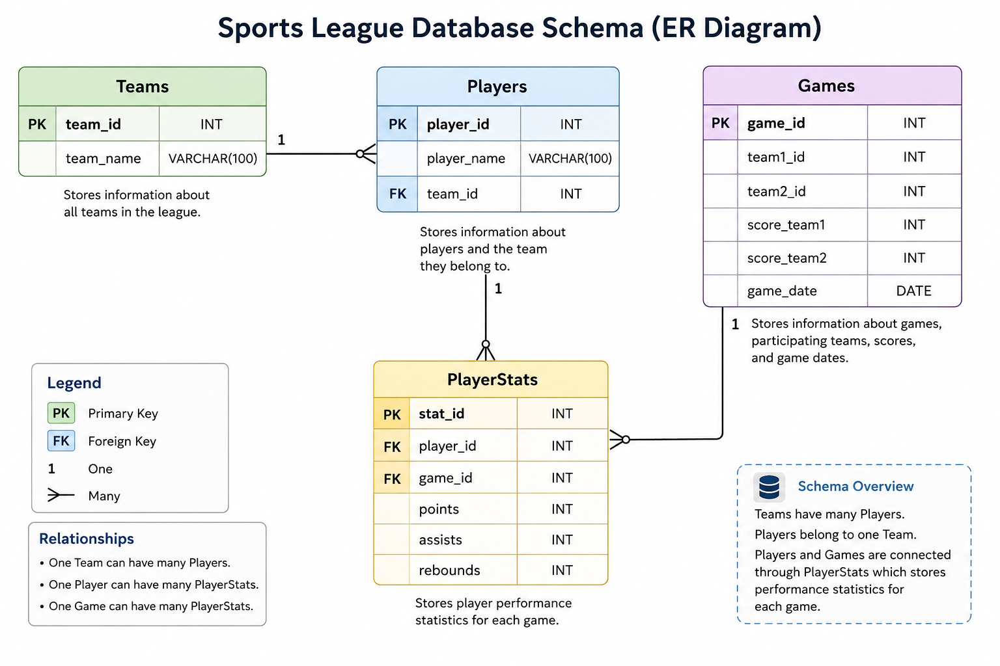

# Sports League Analysis using MySQL

## About the Project

This project is a SQL-based analysis of sports league data using MySQL. The database contains information about teams, players, games, and player statistics.

The main purpose of the project is to use SQL queries to analyze player performance, team performance, game results, and different statistics from the league data.

## Objectives

* Analyze player scoring and performance.
* Compare statistics across different teams.
* Analyze game results and scores.
* Find useful player and team statistics using SQL.
* Practice working with a relational database in MySQL.

## Database Tables

The database contains four main tables:

* **Teams** – Stores team details.
* **Players** – Stores player details and their team assignments.
* **Games** – Stores game details, scores, participating teams, and game dates.
* **PlayerStats** – Stores player statistics such as points, assists, and rebounds for different games.

The tables are connected using primary keys and foreign keys.

## SQL Concepts Used

* SELECT
* WHERE
* BETWEEN
* GROUP BY
* ORDER BY
* COUNT()
* SUM()
* AVG()
* JOIN
* LEFT JOIN
* UNION
* Subqueries
* Views
* Triggers
* UPDATE
* DELETE

## Analysis Questions

The project covers different SQL queries, including:

* Finding the total points scored by each player.
* Finding players who scored between 3 and 6 points.
* Checking players associated with each team.
* Finding games within a 30-day period based on the dataset.
* Creating a view for player statistics.
* Using a trigger to prevent negative points.
* Displaying players along with their teams.
* Calculating total points for each team.
* Finding players who scored more than 5 points.
* Updating a player's team.
* Deleting statistics for a particular game.
* Finding players who scored above the average in a game.
* Finding the top 3 players based on total points.
* Finding teams that have won at least one game.
* Calculating average rebounds for each team.

## Key Findings

Some of the analysis helped identify the highest-scoring players, compare total points across teams, find teams that recorded wins, and compare teams based on average rebounds.

The queries also helped in understanding how player-level statistics can be combined with team and game information to get a broader view of league performance.

## Tools Used

* MySQL
* MySQL Workbench
* SQL

## Database Schema

The database consists of four main tables: Teams, Players, Games, and PlayerStats.

## What I Learned

Through this project, I gained practical experience working with relational databases and writing SQL queries for data analysis. I practiced using joins, aggregations, subqueries, views, triggers, and data manipulation commands to work with sports league data.
